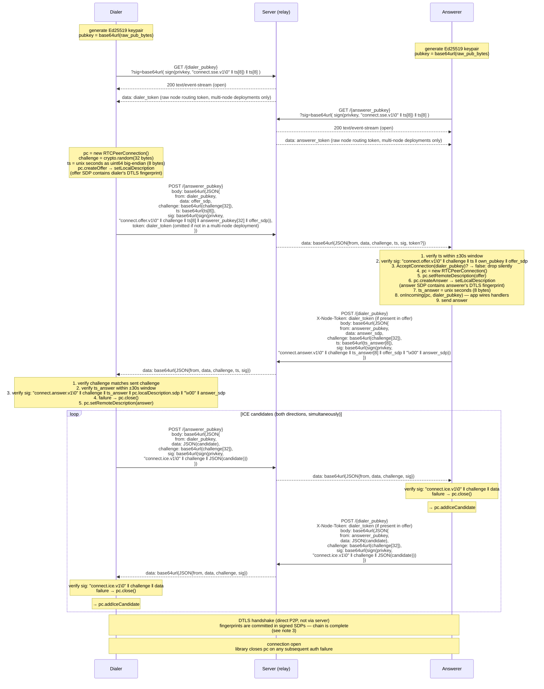

## Notes

1. **Domain separation** — every signing context uses a distinct NUL-terminated tag prefix so signatures from one context cannot be replayed in another:
   - `"connect.sse.v1\0"` — SSE subscription auth
   - `"connect.offer.v1\0"` — offer SDP relay messages
   - `"connect.answer.v1\0"` — answer SDP relay messages
   - `"connect.ice.v1\0"` — ICE candidate relay messages

2. **Session binding via challenge** — the dialer generates a random 32-byte challenge included in the offer. Every subsequent message in the session — the answer and all ICE candidates — must include this challenge in its signed payload. This binds all messages to a single specific negotiation. A valid signed message from a prior session cannot be replayed because its challenge will not match the current session's challenge.

3. **DTLS fingerprint binding without a post-connection handshake** — the offer SDP contains the dialer's DTLS fingerprint (`a=fingerprint:sha-256 ...`) and is signed by the dialer's ed25519 key. The answerer verifies this signature before applying the SDP, establishing that the fingerprint is authentic. The answer SDP contains the answerer's fingerprint, and the answerer's signature covers the full offer SDP alongside the answer SDP — making the answerer's signature a complete statement: "I received this specific offer and answered it with this SDP." The dialer verifies the answer signature using `pc.localDescription.sdp` (the offer it sent), confirming the answerer saw the correct offer (and thus the dialer's certificate within it). When DTLS negotiates and verifies the certificates match the fingerprints in the signed SDPs, the full chain holds: both parties' DTLS sessions are cryptographically bound to their ed25519 identities through the signed SDP exchange. No post-connection handshake is needed. A NUL byte separates `offer_sdp` and `answer_sdp` in the signing payload to keep concatenation unambiguous across two variable-length strings.

4. **Recipient binding in the offer** — the offer signing payload includes `answerer_pubkey[32]` (the raw 32-byte public key of the intended recipient). The answerer verifies that their own pubkey appears in the signed payload, confirming they were the intended recipient. This prevents a malicious relay from forwarding a valid offer to an unintended recipient.

5. **Timestamp freshness** — both offers and answers carry `ts`, an 8-byte big-endian uint64 unix timestamp. The receiver rejects messages with `ts` outside a ±30s window. Offers require freshness to prevent delayed replay of a valid dial. Answers require freshness to maintain symmetric freshness guarantees across the exchange. ICE candidates do not carry `ts` — freshness is guaranteed by the session challenge, which is unique per dial.

6. **Authorization callback** — after signature and timestamp verification, the answerer calls `AcceptConnection(dialer_pubkey)` before creating a PeerConnection or sending an answer. This gives the application control over who can initiate connections. Returning false drops the offer silently (no error response to the dialer) to avoid leaking information about whether the key is active.

7. **Auth failure closes the PC** — any verification failure (invalid signature, wrong or missing challenge, stale timestamp, unacceptable pubkey) causes the library to call `pc.close()` immediately and discard the message. The application may observe the connection close if auth fails on a message received after `onIncoming` fires. `onIncoming` means "a valid authenticated offer arrived and an answer was sent" — not "a working P2P connection exists." The connection is established only after DTLS completes.
