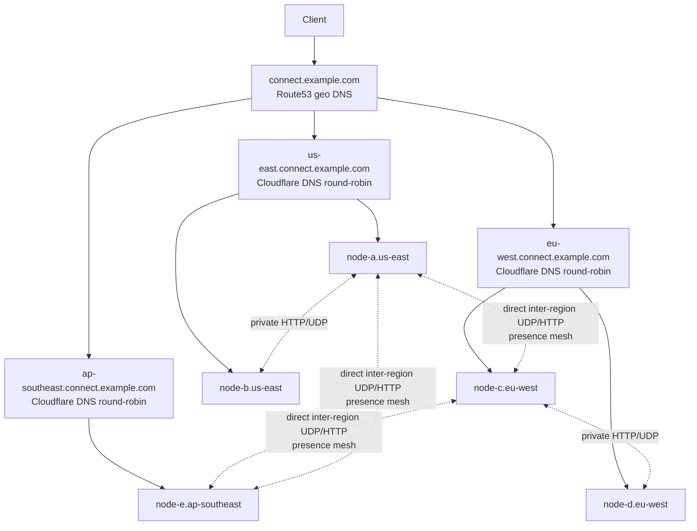
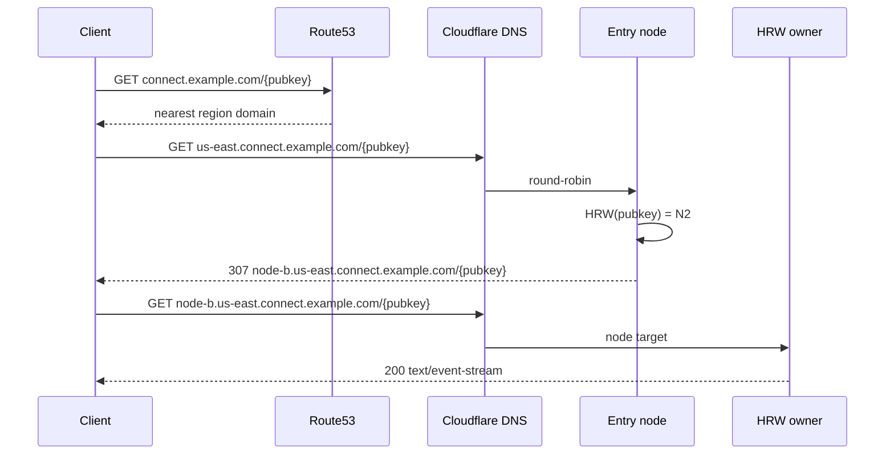
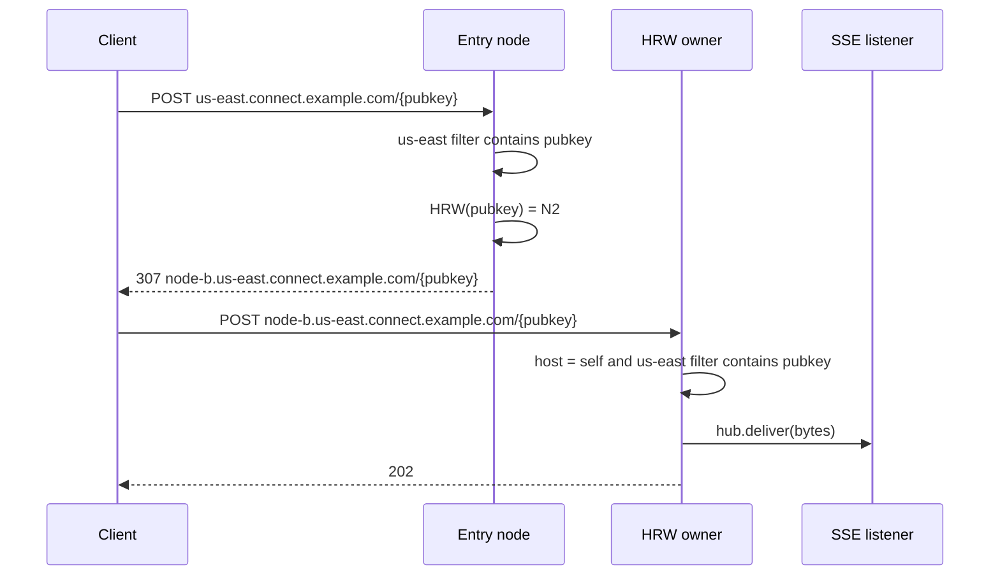
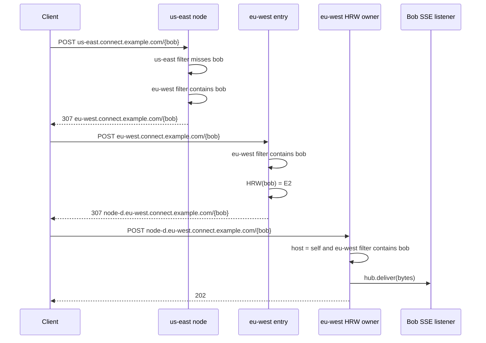
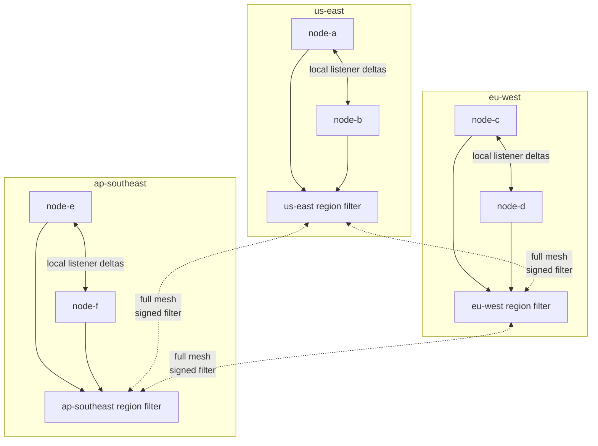
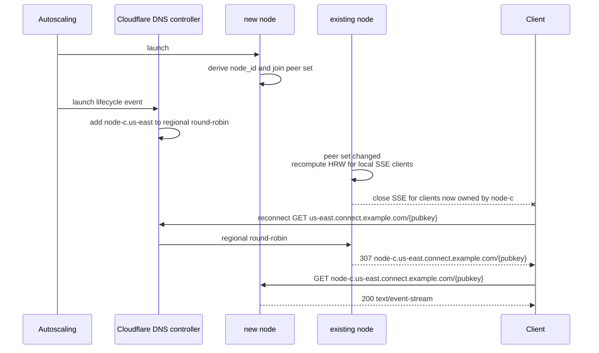
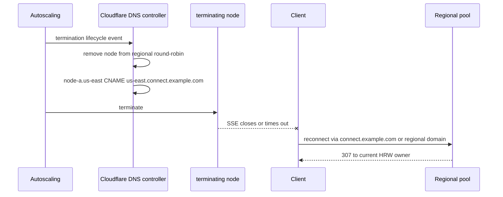
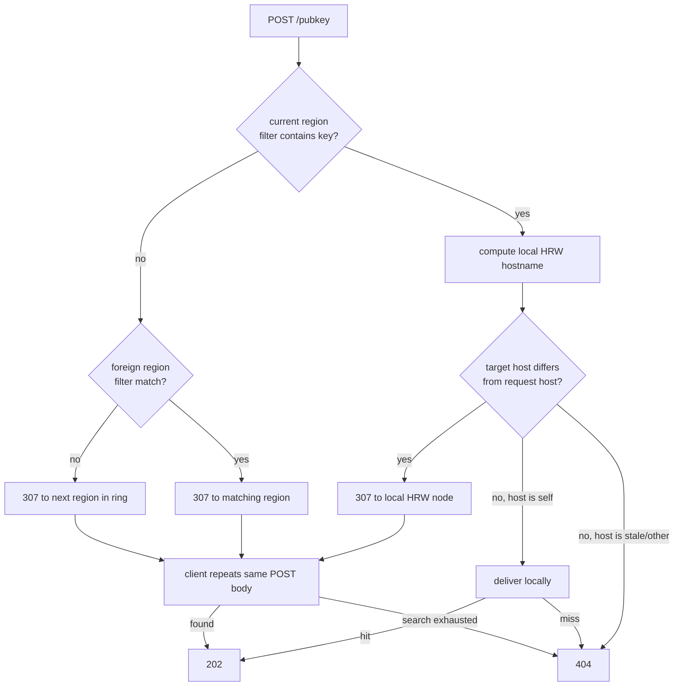

# Multi-Region Signaling Architecture

Desired end state for a low-cost, fast, region-aware WebRTC signaling relay.

The relay stays opaque: clients GET an SSE stream and POST bytes to a pubkey. Servers do
not parse SDP, ICE, JSON envelopes, or client message type. All smart routing is in DNS,
node hostnames, HRW, and regional presence filters.

Priority order:

1. Cost
2. Speed
3. Regional reliability

---

## Architecture



| Layer                                    | Owner          | Purpose                                                    |
| ---------------------------------------- | -------------- | ---------------------------------------------------------- |
| `connect.example.com`                    | Route53        | Geo DNS to nearest regional domain                         |
| `{region}.connect.example.com`           | Cloudflare DNS | Regional round-robin over live nodes                       |
| `node-{id}.{region}.connect.example.com` | Cloudflare DNS | Stable node target; CNAMEs to regional domain during drain |

There are no AWS load balancers and no Cloudflare Load Balancers. Cloudflare is DNS for
regional and node records. Inter-node presence traffic uses direct node addresses, not
Cloudflare.

---

## Core Rules

```text
node_id = hex(HMAC-SHA256(cluster_node_id_secret, node_public_key)[0:8])

score(pubkey, peer) = hash64(pubkey || "\x00" || peer.node_id)
owner                = peer with highest score
```

Hostnames carry the routing budget:

| Request host    | Meaning                    | Server behavior                                                                        |
| --------------- | -------------------------- | -------------------------------------------------------------------------------------- |
| Regional host   | First regional hop         | Normal lookup; usually 307 to a node or region                                         |
| Own node host   | Arrived at intended node   | Normal lookup; deliver only if this node is still the target                           |
| Other node host | DNS drain/failure fallback | Recompute current target; 307 if target differs, 404 if it points back to the bad host |

Clients provide one routing hint: `X-Node-Token` on POST requests. This token is received from the target's SSE `event: node` first message and is included in offer bodies so that the answerer can attach it to replies. The server uses it to skip the gossip lookup and deliver directly to the target's home node. Absent the token, the server falls back to normal gossip-based routing.

GET establishes where a pubkey listens. POST looks for the pubkey. Every POST checks
the current region filter first:

1. If the key is in this region, compute the current regional HRW node and 307 there.
   If the request is already on that node hostname, deliver locally.
2. If the key is not in this region, 307 to the region selected by distributed presence.
3. If a drained/stale hostname recomputes to itself, return 404 instead of looping.

Any peer-set change triggers an SSE ownership sweep. A node closes local SSE streams for
pubkeys whose HRW owner is no longer itself; clients reconnect through the normal GET
flow and land on the new owner.

---

## Flow: SSE GET



Clients reconnect from their configured server URL, not from cached node URLs. The node
URL is an implementation detail of redirect handling.

---

## Flow: POST In Region



The POST body is never inspected. The in-region reroute is a 307 so the client repeats
the same opaque POST body at the current HRW owner.

---

## Flow: POST Wrong Region

Each region publishes one region-level presence filter:

```text
region_filter[region].Contains(pubkey)
```

The filter says which region probably has the pubkey, not which node has it. POSTs do
not become server-side cross-region forwards. A cluster looks locally; on miss, it sends
the client a 307 to the next candidate cluster so the client repeats the same opaque
POST body there.



Candidate order is nearest matching region filters first, then the remaining regions in
a deterministic ring. Any search state is encoded by the server in the 307 target URL;
clients only follow redirects. If the search is exhausted, return 404.

---

## Presence Distribution

Each region maintains one logical filter:

```text
region_filter = xor8(all active SSE pubkeys in this region)
```

Simplest topology: full mesh.



Presence rules:

- On SSE open, the owner adds the pubkey to the local region set.
- On SSE close, the owner removes the pubkey from the local region set.
- Nodes in the same region exchange listener add/remove deltas directly.
- Each region publishes a signed full region filter to every other region.
- Full filters are sent every 5-10s at first; 60s is acceptable after delta repair exists.
- UDP can announce a new filter version; HTTP can fetch the full filter if needed.

The filter is only a routing hint. A false positive causes one extra 307. A false
negative causes the search to continue to the next region.

---

## Flow: Node Joins



This keeps GET ownership aligned with HRW after scale-out. The disconnect is intentional
and bounded to keys whose owner changed.

---

## Flow: Node Terminates



Abrupt failure follows the same end state after health detection. Other nodes cache a
failed peer after the first timeout so redirects stop pointing at a dead HRW owner.

---

## Failure Cases



Expected misses:

| Case                                      | Result                                                                                |
| ----------------------------------------- | ------------------------------------------------------------------------------------- |
| Filter false positive                     | One extra 307 to a region that returns 404 or continues the search                    |
| Filter false negative                     | 307 search continues to the next region in the deterministic ring                     |
| Dead local owner                          | Redirect target is suppressed after health detection or peer timeout                  |
| Old node hostname CNAMEs to regional pool | Receiver recomputes target; 307 if different, 404 if it points back to the stale host |

---

## Rough Costs

Assumptions: xor8 at ~9.1 bits/key, direct inter-region presence mesh, and one filter
per region. Initial full-filter cadence is 10s; 60s is the later target once delta
repair exists.

| Scope                                        | Bandwidth estimate                                                 |
| -------------------------------------------- | ------------------------------------------------------------------ |
| Key, full snapshot                           | ~1.14 bytes per foreign edge                                       |
| Key, 2 foreign edges at 10s cadence          | ~0.23 B/s steady-state                                             |
| Key, 2 foreign edges at 60s cadence          | ~0.038 B/s steady-state                                            |
| Key, connect/disconnect delta                | ~150-250 bytes per forwarded edge                                  |
| Node, local delta publish                    | ~150-250 bytes per local connect/disconnect                        |
| Node, ownership sweep                        | O(local SSE clients) CPU on peer-set change; no extra body traffic |
| Node, POST redirect                          | One 307 plus repeated opaque POST body; max body 8KB               |
| Region, 100k-key snapshot                    | ~112KB per foreign region; ~11KB/s at 10s or ~1.9KB/s at 60s       |
| Region, 1M-key snapshot                      | ~1.1MB per foreign region; ~110KB/s at 10s or ~19KB/s at 60s       |
| Region, false-positive POST                  | One extra client-followed 307 and repeated POST body               |

Region-level filters keep snapshot bandwidth proportional to keys per region, not
`keys * nodes`.

---

## Reconnect And Failure Timing

Actual reconnect time includes client backoff and TCP/SSE behavior. These are operating
targets, not hard guarantees.

| Failure                          | Expected client impact                                                           |
| -------------------------------- | -------------------------------------------------------------------------------- |
| Scale-out ownership change       | Affected SSE streams are closed; reconnect usually lands healthy in 1-5s         |
| Graceful scale-in                | Regional DNS updated before termination; reconnect usually lands healthy in 1-5s |
| Process crash with closed socket | Client reconnect starts immediately; usually 1-10s                               |
| Abrupt node loss or blackhole    | Health detection plus SSE timeout; expect 20-60s worst common case               |
| Cached old node URL              | Node CNAME sends it to regional pool after DNS update                            |
| Dead HRW owner for POST          | Redirect target suppressed after peer timeout or health detection; expect 2-30s  |
